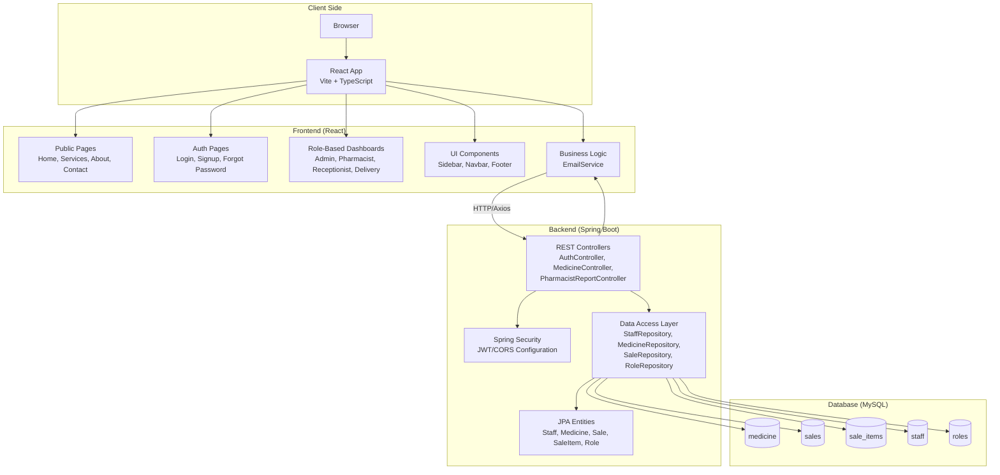
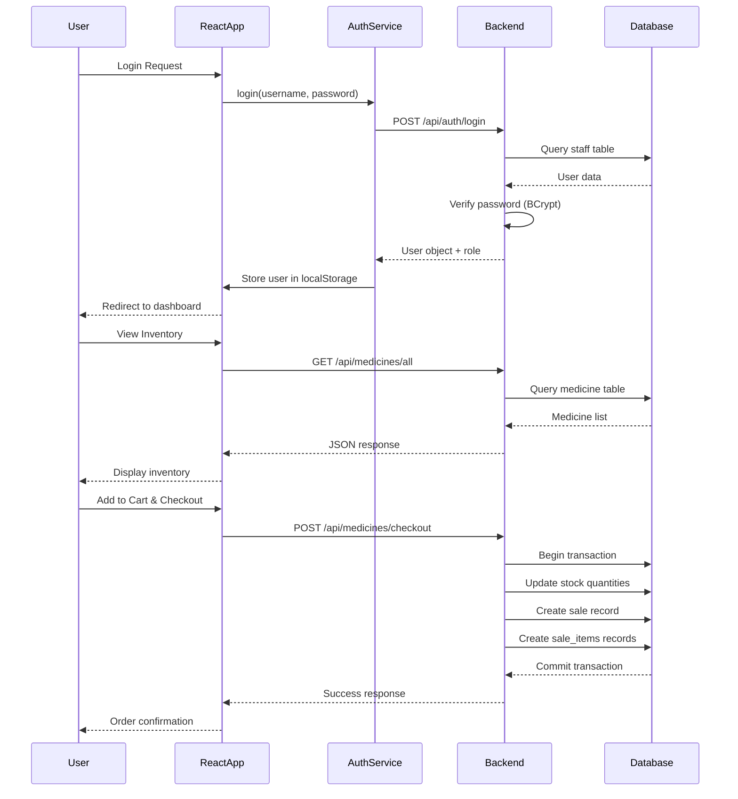
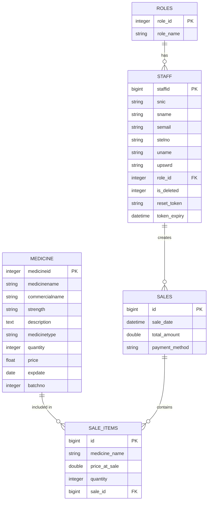
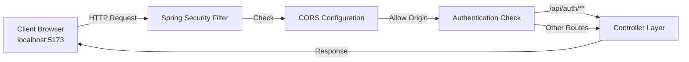

# Phillips Pharmacy & Medicare Management System - Architecture Diagram

## System Overview

This is a full-stack Pharmacy Management System (PMS) built with a React TypeScript frontend and Spring Boot + MySQL backend.

## High-Level Architecture



## Data Flow Diagram



## Component Architecture

### Frontend Structure

```
frontend/
├── src/
│   ├── api/
│   │   └── authService.js          # Authentication API calls
│   ├── components/
│   │   ├── layout/                 # Layout wrappers
│   │   ├── navbars/               # Navigation components
│   │   ├── footers/               # Footer components
│   │   └── ParticlesBackground.jsx
│   ├── pages/
│   │   ├── auth/                  # Login, Signup, Password Reset
│   │   ├── landing/               # Public pages (Home, Services, About, Contact)
│   │   ├── dashboards/            # Role-based dashboard homes
│   │   └── userScreens/           # Role-specific functional pages
│   │       ├── pharmacist/        # Inventory, Alerts, Prescriptions, Reports
│   │       ├── admin/             # System Logs, User Management, etc.
│   │       └── receptionist/      # Customer management
│   ├── services/
│   │   └── medicineService.js    # Medicine API calls
│   ├── App.jsx                    # Routing configuration
│   └── main.jsx                   # Application entry point
```

### Backend Structure

```
backend/src/main/java/com/phillipspharmacy/medicare/
├── config/
│   └── SecurityConfig.java        # Spring Security + CORS configuration
├── controller/
│   ├── AuthController.java        # Login, Signup, Password Reset
│   ├── MedicineController.java    # CRUD + Checkout operations
│   └── PharmacistReportController.java  # Sales reports
├── model/
│   ├── Medicine.java              # Medicine entity
│   ├── Staff.java                 # Staff/User entity
│   ├── Role.java                  # Role entity
│   ├── Sale.java                  # Sale transaction entity
│   ├── SaleItem.java              # Sale line items
│   └── OrderItem.java             # DTO for checkout
├── repository/
│   ├── MedicineRepository.java    # Medicine data access
│   ├── StaffRepository.java       # Staff data access
│   ├── SaleRepository.java        # Sales data access
│   └── RoleRepository.java        # Role data access
├── service/
│   └── EmailService.java          # Email notifications
└── PhillipsPharmacySystemApplication.java  # Spring Boot main
```

## Database Schema



## API Endpoints

### Authentication Endpoints
- `POST /api/auth/login` - User login
- `POST /api/auth/signup` - User registration
- `POST /api/auth/forgot-password` - Request password reset
- `POST /api/auth/reset-password` - Reset password with token
- `GET /api/auth/roles` - Get available roles

### Medicine Endpoints
- `GET /api/medicines/all` - Get all medicines
- `POST /api/medicines/add` - Add new medicine
- `PUT /api/medicines/update/{id}` - Update medicine
- `DELETE /api/medicines/delete/{id}` - Delete medicine
- `GET /api/medicines/low-stock` - Get low stock items (< 10)
- `GET /api/medicines/expiry-count` - Count expiring items (next 30 days)
- `POST /api/medicines/checkout` - Process sale/checkout

### Report Endpoints
- `GET /api/reports` - Generate sales reports

## Technology Stack

| Layer | Technology |
|-------|-----------|
| Frontend Framework | React 19.2.0 + TypeScript |
| Build Tool | Vite 7.2.4 |
| Routing | React Router DOM 7.12.0 |
| HTTP Client | Axios 1.13.2 |
| Styling | TailwindCSS 4.2.4 |
| Backend Framework | Spring Boot 4.0.1 |
| Java Version | Java 21 |
| ORM | Spring Data JPA + Hibernate |
| Security | Spring Security + BCrypt |
| Database | MySQL 8+ |
| Email | Spring Boot Mail Starter |

## Security Architecture



## Role-Based Access Control

```mermaid
graph TD
    Admin[Admin Role]
    Pharmacist[Pharmacist Role]
    Receptionist[Receptionist Role]
    Delivery[Delivery Person Role]
    
    Admin --> AdminDashboard[Admin Dashboard]
    Admin --> UserManagement[User Management]
    Admin --> SupplierManagement[Supplier Management]
    Admin --> InventoryManagement[Inventory Management]
    Admin --> SystemLogs[System Logs]
    Admin --> AdminReports[Admin Reports]
    
    Pharmacist --> PharmacistDashboard[Pharmacist Dashboard]
    Pharmacist --> Inventory[Inventory Management]
    Pharmacist --> Alerts[Low Stock/Expiry Alerts]
    Pharmacist --> Prescriptions[Prescription View]
    Pharmacist --> Reports[Sales Reports]
    
    Receptionist --> ReceptionistDashboard[Receptionist Dashboard]
    Receptionist --> CustomerLookup[Customer Lookup]
    
    Delivery --> DeliveryDashboard[Delivery Dashboard]
```



## Key Features Flow

### Inventory Management Flow
1. Pharmacist logs in → Redirected to Pharmacist Dashboard
2. Navigate to Inventory Page
3. View all medicines (GET /api/medicines/all)
4. Add/Edit/Delete medicines (POST/PUT/DELETE)
5. Low stock alerts automatically shown (GET /api/medicines/low-stock)
6. Expiry tracking (GET /api/medicines/expiry-count)

### Sales/POS Flow
1. Customer selects medicines
2. Items added to cart (client-side state)
3. Checkout initiated
4. POST /api/medicines/checkout with cart items
5. Backend:
   - Validates stock availability
   - Reduces stock quantities
   - Creates sale record
   - Creates sale_item records
   - Returns confirmation
6. Receipt displayed to customer

### Authentication Flow
1. User navigates to login page
2. Enters credentials
3. POST /api/auth/login
4. Backend:
   - Finds active user (is_deleted = 0)
   - Verifies password with BCrypt
   - Returns user object with role
5. Frontend stores user in localStorage
6. ProtectedRoute component checks role
7. Redirects to appropriate dashboard

## Deployment Considerations

- Frontend runs on port 5173 (Vite dev server)
- Backend runs on port 8080 (Spring Boot default)
- CORS configured to allow frontend origin
- MySQL database connection configured in application.properties
- Email service requires SMTP configuration
- Passwords hashed with BCrypt
- Soft delete implemented for staff (is_deleted flag)
